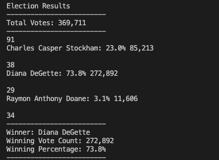
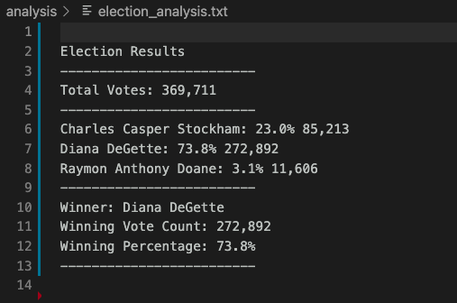
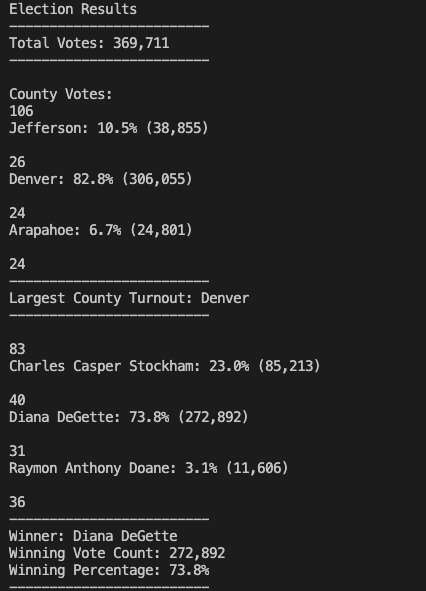

# Election_Analysis

## Overview of Election Audit

For this project, we were assigned a task in order to assist a Colorado Board of Elections employee. The task required tabulating and auditing the results of a local congressional election. There were three candidates: Diana DeGette; Charles Casper Stockham; Raymon Anthony Doane. The data regarding the election, votes, and candidates was provided in a Data Source CSV file. The goal of this assignment was the following:

- Calculate the number of votes casted
- List the candidates who received the votes
- Determine the percentage of the candidate's votes
- Retrieve vote count of the candidates
- Determine the winner of election based on popular vote
- Analyze votes by county

## Election -Audit Results

The analysis of the data from the election showed that the clear winner, based on the popular vote, was Diana Degette. Charles Casper Stockham finished at distanced second place, and Raymon Anthony Doane finished last. The following are the results of our analysis:

- There were 369,711 casted votes
- DeGette received 73.8% of the votes casted (total of 272,892 votes)
- Stockham received 23% of the votes casted (total of 85,213 votes)
- Doane received 3.1% of the votes (total of 11,606 votes)
- Denver had the largest county turnout (306,055 / 82.8% of casted votes)

The winner of Colorado's congressional election was Diane DeGette. Her decisive victory showed she was the strongest candidate in this race. Denver, Jefferson, and Arapahoe counties were also analyzed for this analysis. It included county votes, the percentages of voters, and the largest county turnout. Denver had the strongest voter turnout, followed by dissapointing results in Jefferson and Arapahoe. 
 
### Fig. 1

 ### Fig. 2
 

 ### Fig. 3
 

## Resources

During this assignment, we were introduced to Python; the most widely used programming language used as a scripting language for web applications. Python efficiently enabled the process of writing algorithms to analyze the election results. This programming language has risen in popularity due to its simple structure, efficiency in automating a specific series of tasks, and ease to read and maintain. Additionaly, it has a broad standard library. 

Python was not the only tool used to execute the scripts needed for the analysis. Visual Studio code (VS Code), another powerful tool, was configured to use the Python environment installed. VS Code provides helpul integration features that can be used for working with different environments. This free text editor is one of the most popular developer tools. 

VS Code is also widely used by millions of programmers aroung the world. Having these two programs working in conjuction to analyze the data made the workflow faster and increased productivity. The Python version required for this project was 3.7.6, but version 3.8.5 was a better choice for security reasons. The version of VS Code used was 2.3.0. 

## Election-Audit Summary

This script was tested for errors during the coding process. If there are errors with the code, it will not allow for it to run. This detailed script can be used as a template for future elections in in your district. It can also serve as template to guide employees of the Board of Elections to conduct their own analysis using Python and VS Code. In addition, the script can be used for other purposes as well (e.g., school districts, state-wide elections). 

As stated above, the program is relatively user friendly, easy to follow and interpret. More needs to be done, however, to entice residents from Jefferson and Arapahoe counties to vote. In fact, a similar process to analyze why these counties had a poor turnout should be carried out using this advanced technology. 

